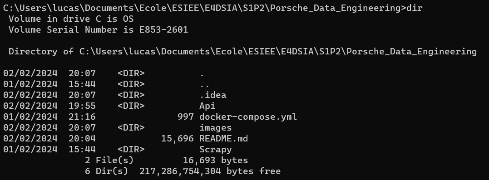
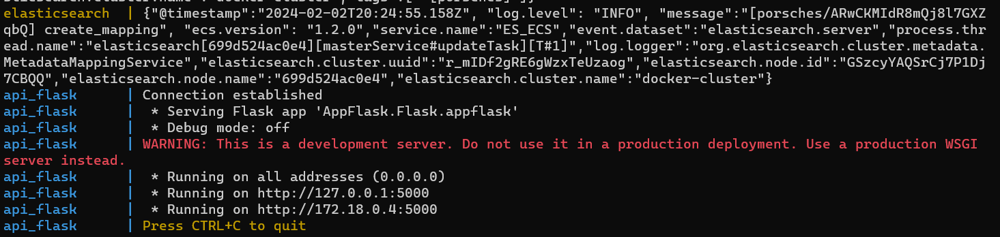
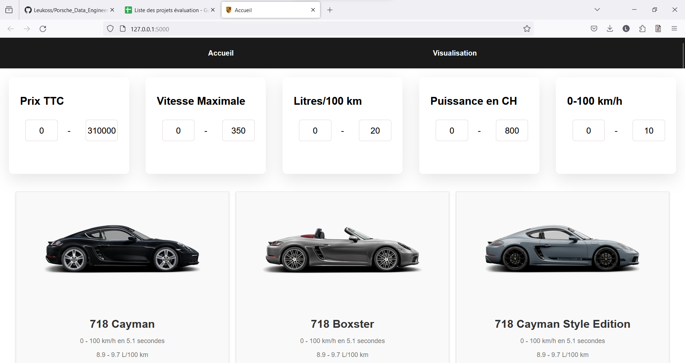
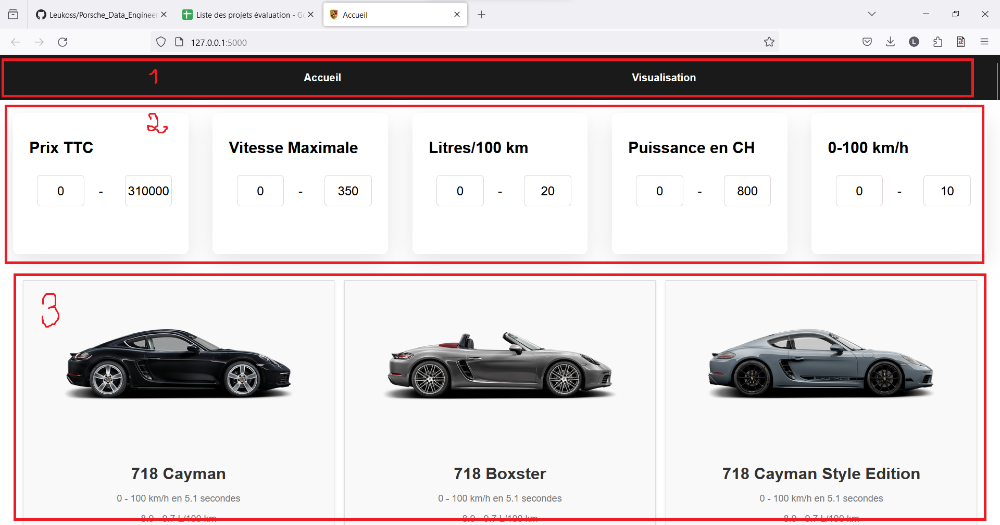
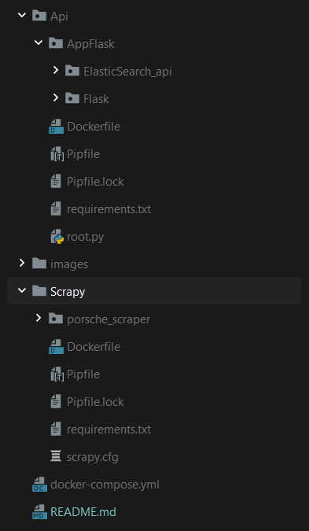
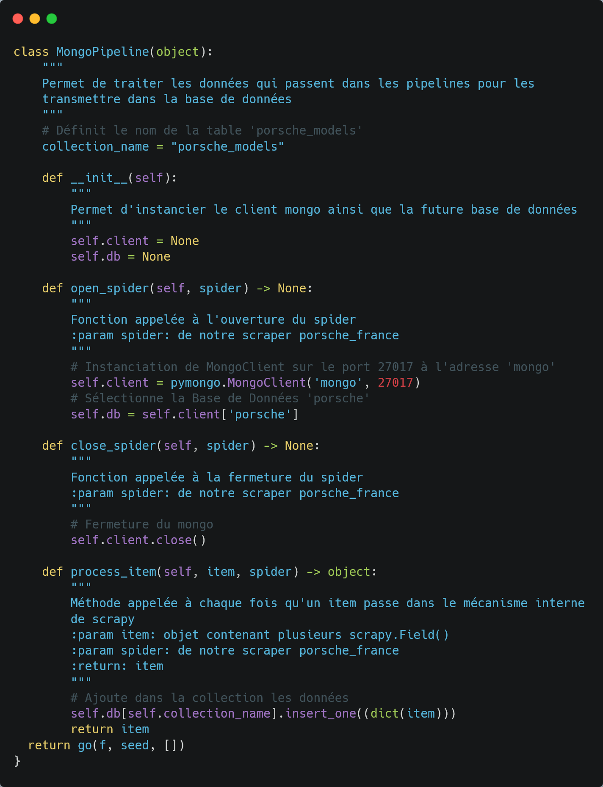

## THIS README IS IN FRENCH, PLEASE USE TRANSLATER IF NEEDED

## Bonus - Scraping en temps réel
## Bonus - Docker-compose
## Bonus - ElasticSearch

## Bonus - 3/3

# Tables des matières

## Guide de l’utilisateur
1. [De Git au répertoire local](#1---de-git-au-répertoire-local)
2. [Lancer le programme python et accéder au Dashboard](#2---lancer-le-programme-python-et-accéder-au-dashboard)
3. [Utiliser le Dashboard](#3---utiliser-le-dashboard)

## Guide du développeur
1. [Contexte](#1---contexte)
2. [Structure logique](#2---structure-logique)
3. [Continuer le développement](#3---continuer-le-développement)

# GUIDE DE L’UTILISATEUR

## 1 - De Git au répertoire local

Dans cette partie, nous allons nous intéresser sur comment récupérer le projet 
disponible sur Git dans le but de l’avoir sur la machine locale.

### Prérequis

- Ce projet est codé en python, c'est pourquoi il est nécessaire d’installer 
ce langage de programmation (ou le mettre à jour si nécessaire). Cependant,
ayant recours à 'Docker', seul ce dernier est nécessaire afin de lancer ce 
projet :

[Installer la dernière version de Docker Desktop](https://www.docker.com/products/docker-desktop/)

- Par ailleurs, il est nécessaire de disposer de Git afin de cloner le projet

[Télécharger Git](https://git-scm.com/download/win)

### Exportation du projet et téléchargement des modules nécessaires

Une fois que vous disposez de ces prérequis, nous allons pouvoir exporter le 
projet sur votre répertoire local :

Cela se déroule en deux étapes :

1. Cloner le répertoire sur sa machine :

   Pour ce faire, ouvrez le ‘Git Bash’ (vous pouvez le chercher depuis la barre
   de recherche windows). Rentrez la commande suivante dans ‘Git Bash’ :

   *git clone https://github.com/Leukoss/Porsche_Data_Engineering.git*
     

2. Lancer le docker :

   Pour ce faire, ouvrez l' ’Invite de Commandes’ (vous pouvez la chercher 
   depuis la barre de recherche windows). À l’aide de la commande ‘cd’ rejoignez
   votre dossier ‘Porsche_Data_Engineering’ qui correspond au dossier
   cloné de Git.  

   Si vous rentrez la commande ‘dir’(windows, ‘ls’ pour unix) une fois dans 
   le dossier, vous devriez voir ceci :  

   

   ⚠Si ce n’est pas le cas, assurez-vous de bien vous 
rendre dans ce dossier avant de continuer⚠   

## 2 - Lancer le docker et accéder au Dashboard

Depuis ce dossier, rentrez la commande suivante :  

*docker-compose up*

Veuillez bien attendre la fin de tous les téléchargements dans votre 
‘Invite de Commandes’. Puis, MongoDB s'instanciera suivi du scraping. Enfin, 
ElasticSearch, MongoDB et Flask se lanceront :

S’il n’y a aucun problème, ouvrez http://127.0.0.1:5000/ dans un navigateur web 
(firefox, chrome…) sans fermer votre ‘Invite de Commandes’ (le root.py a besoin 
de tourner pour mettre à jour les données sur votre dashboard).

## 3 - Utiliser le Dashboard

Lorsque vous ouvrez cet url, vous devriez obtenir ceci :

Voici quelques brèves annotations sur l’utilisation du site :

1. C’est la barre de navigation.
2. La ligne des filtres disponibles pour sélectionner les voitures.
3. Les différents modèles correspondants aux valeurs des filtres.

Pour la page visualisation, vous y trouverez des comparaisons entre différents
caractères des modèles courants permettant d'analyser les relations entre ces 
derniers.

Bonne exploration ٩(^ᴗ^)۶

# GUIDE DU DÉVELOPPEUR

## 1 - CONTEXTE

Dans un premier temps, il est important de notifier que pour que les codes 
soient compréhensibles par un maximum de personnes, nous avons codé en anglais.

Nous respectons au maximum les conventions 
[pep-8](https://peps.python.org/pep-0008/)

Nous ne nous attarderons pas à la compréhension totale des codes, nous 
expliquerons juste nos choix, nos raisons et la structure logique qui encadre 
tout ça.

De plus, rappelons que notre objectif est d’avoir un aperçu rapide des modèles 
de Porsche disponibles en se concentrant sur le développement avec de nouveaux
outils tels que MongoDB, Flask, Scrapy, ElasticSearch ou encore Docker.

## 2 - STRUCTURE LOGIQUE

Voici la structure complète du projet :

Dans un premier temps, le dossier 'Scrapy' contient l'ensemble des éléments 
permettant de lancer le scraping. Afin de pouvoir envoyer de manière optimale 
nos données au sein de notre database MongoDB, nous avons recours à une 
modification des pipelines et des settings.

Dans un second temps, nous constituons un dossier contenant l'ensemble des 
outils nécessaires afin de réaliser notre application. Nous aurons notamment 
recours à Flask (ce projet était l'occasion de découvrir un nouvel outil lorsque
Dash Plotly a déjà été utilisé pour un projet antérieur. Une nouvelle approche 
aujourd'hui serait d'utiliser Django dans la mesure du possible), MongoDB ainsi
qu'ElasticSearch. Enfin, l'utlisation des dockers étant imposée nous nous 
sommes munis de cet outil.

Ayant d'ores et déjà utilisé MongoDB pour stocker les données, sa réutilisation 
est évidente.

Pour ce qui est de Flask, encore une fois c'était l'occasion d'utiliser un 
nouvel outil. Ayant d'ores et déjà touché à du html/css/js pour des projets
personnels, il était abordable d'utiliser cet outil pour réaliser notre 
application.

Enfin, saisir l'opportunité de s'introduire à un moteur de recherche ultra 
puissant comme ElasticSearch nous a semblé évident.

Finalement, les dockers se révèlent incontournables pour transmettre notre 
projet. En effet, fini les lignes de commandes à rentrer dans le terminal afin
d'installer les dépendances nécessaires ou encore la résolution de problèmes de
compatibilité. Nous avons d'ailleurs pris la décision d'avoir recours à un
docker-compose pour faciliter son utilisation pour les utilisateurs. Un
temps aura été pris pour s'assurer que l'instance d'ElasticSearch et celle de l'
API ne rentre pas en conflit. En effet, si l'API se lance après l'instanciation
d'ElasticSearch et que cette dernière est incomplète, alors la connexion ne sera
pas établie...

## 3 - CONTINUER LE DÉVELOPPEMENT

Voici rapidement quelques idées d’ajouts, ou axes d’améliorations :

- Utiliser Django à la place de Flask
- Restructurer davantage le code car des améliorations sont envisageables
- Ajouter en JavaScript des barres avec deux bulles permettant de moduler les
valeurs des filtres (implémentées dans une version antérieure mais par souci de
stabilité, cette feature a été retirée)
- Ajouter de nouvelles analyses
- Ajouter un nouveau style css/js pour rendre le site encore plus agréable

Bon code ٩(^ᴗ^)۶
